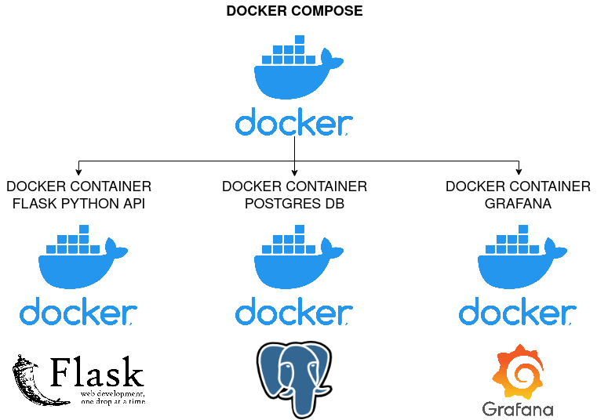

## Heatmap Lidar



### Initial Setup

1. Create the docker volumes and network by executing the init.sh script
  ```bash
  ./src/init.sh
  ```

2. Inside the docker directory (Set the --build flag only for the first time, or if there are changes made to the flask or dash app images)
  ```bash
  docker-compose up --build
  ```

### Functionality

- Dash: http://localhost:8050
- Flask API: http://localhost:5000
- Postgres: localhost:5432

To create the factory table in the database, execute the command passing width and height as arguments, e.g.
- ./create_table.sh \<width\> \<height\>
- ./create_table.sh 10 20

To insert a registry into the factory table, send a post request to the following endpoint:

- http://localhost:5000/insert

With a json body, with the following fields and values:
- width: (int)
- height: (int)
- date: (string of timestamp)
- data: (list of ints, size width * height)

